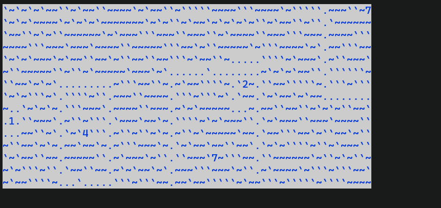
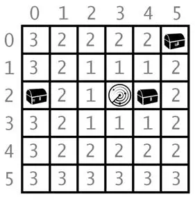

# Sonar In C++

This is a tiny game made in C++ using pdcurses(curses for windows), random library & formatting library, compiled with cmake.

I have made this 3 years ago, compiled using CLion. But you can compile it using visual studio after installing pdcurses.

if you are running linux, it'll just work to switch from pdcurses to ncurses in CMakeLists.txt.

## How to play game

On clicking space on a point, You'll drop a sonar device,
which shows distance between that point to nearest treasure.

drop a few sonars, and you'll figure out the treasure.
distance:

(Taken from inventwithpython)